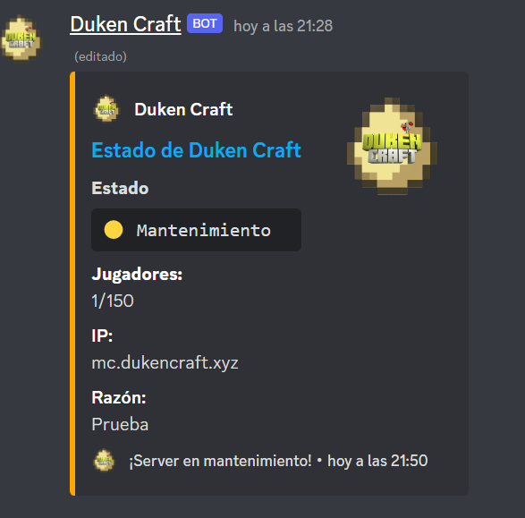

# Status Mc

***

### [**Spigot Url**](https://www.spigotmc.org/resources/mc-discord-server-status-bot.96831/)
***

#  Cosas que hacer (opcional):
- Crea tu propio mensaje de status.
- Crear sistema de avisos si hay mantenimiento etc...

# Iniciar el Bot:
1. - Usa `npm i` para actualizar paquetes.
2. - Usa `node .` para iniciar el bot.

# Instalación:
1. Escibre `npm i` en el cmd si no lo has echo aún.
2. Edita `config.json` como tu quieras.
3. Edita `.env` y añade lo necesario.
4. Añade, la ip del server, el puerto, Muestre la IP y el canal donde desea que se envie el embed incrustado en el archivo `.env`
5. Inicia el bot usando `node .`
6. Detenga el bot una vez que se haya enviado el mensaje.
7. Copie el ID del mensaje y péguelo en el archivo `.env`
8. Inicia el bot otra vez.

───────────────────────────────────────
Terms And Conditions
───────────────────────────────────────
​
By purchasing any of my resource, you automatically accept this terms weather you read them or not.

You are NOT allowed to share or redistribute my products.
You are NOT allowed to resell my products.
You can NOT claim my products as your own.
You may only use this product on your own server.
All purchases are final and no refunds will be given.
If you request refund or chargeback your license will be permanently removed.
Prices are subject to change at any time without notice.
I reserve the right to change these terms without notice.

# Creditos
Creado por <a href="https://github.com/Lukeos11">Lukeos11</a> traducido y modificado por <a href="https://github.com/gonaaal">Gonaaal</a>

